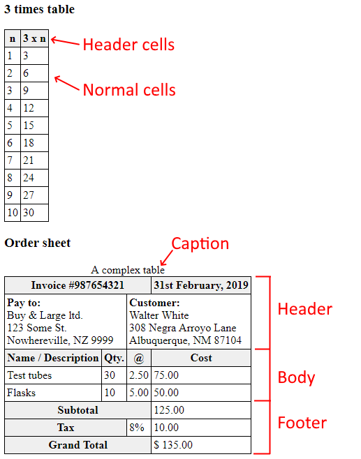
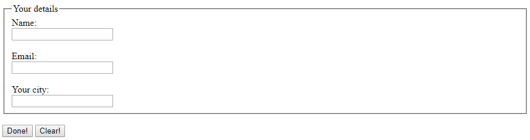
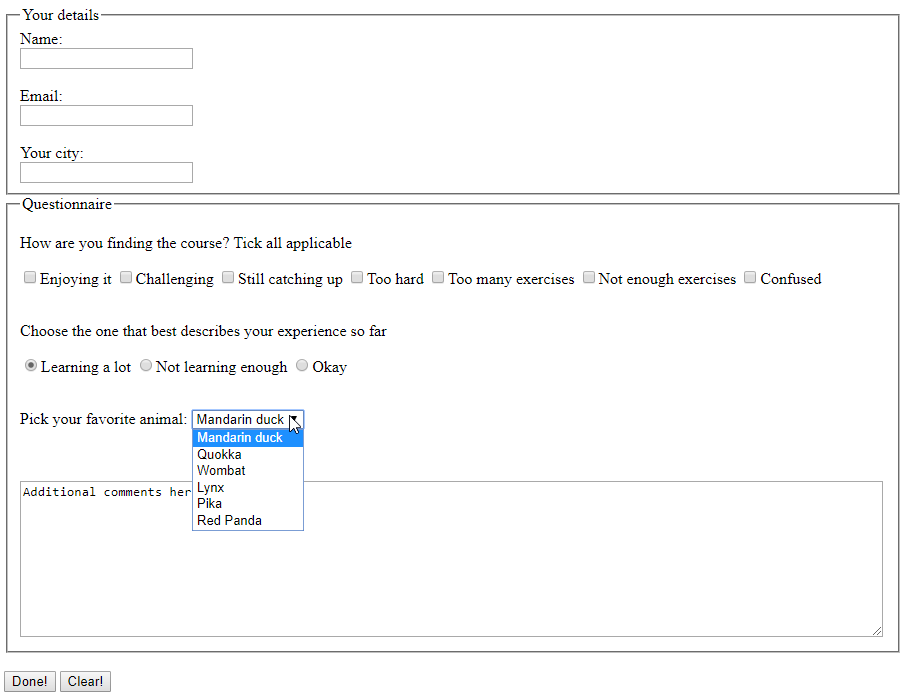

# Web Lab &ndash; HTML II

In this lab, we continue our HTML coverage, with slightly more advanced constructs like images, tables, and hyperlinks.

## Obtaining the code

Now that you've obtained a copy of this repository through GitHub Classroom's invite, you have your own private version of this repository (i.e. the one you're looking at now)! To clone this repository onto your machine, click the green `Code` button, make sure `HTTPS` is selected, then click the `copy` button to the right of the web URL to copy its value. Then, clone onto your local machine from a terminal, using the `git clone` command.

If this is the first time you've ever cloned a repository on the current machine, you may be asked to enter your GitHub credentials. The "sign in with your browser" option should work just fine. You may need to enter your GitHub username and password, and / or authorize "git credential manager" to access your account. Perform these steps if asked.

Now, you should have a clone of your repository on your local machine, ready to develop!

Remember to commit and push your work regularly for backup purposes.

Explore the files in the project, familiarizing yourself with the content. Open the project in Visual Studio Code by right-clicking the lab folder and selecting *"Open with Code"* (or, if this option is not available, you may open VS code and select *"File"* ➡ *"Open Folder"*).

## Exercise One &ndash; Displaying tabular data

Open the [`tables.html`](./exercises/ex01/tables.html) file from the [`ex01`](./exercises/ex01) folder. In this file, you'll see two tables which you must complete.

Complete these tables so they appear as shown in the screenshot below.



**Note:** You don't need to worry about coloring the header cells - this will be done automatically via the included *css* file (you'll learn about CSS yourself in an upcoming lab!).

**Hint:** For the second table, remember that some cells take up more than one column. Use the `colspan` attribute to allow this.

## Exercise Two &ndash; Including local images

In the [`ex02`](./exercises/ex02) folder, create a new HTML file called `banknotes.html` (you can do this from within VS Code). In the body of this document, include the four images from the `ex02` folder using the `` tag.

Manipulate the images that you have included in the page so that they each have the same width on the page.

## Exercise Three &ndash; Linking to external pages

Explore the [`ex03`](./exercises/ex03) folder in VS Code.

In each of the three HTML files that can be found in the directory, there are a number of unformatted URLs in the text. Modify these such that they are shown as clickable hyperlinks that link to the indicated URL, with the text of the hyperlink indicating the page or page section they are linking to, and the title attribute of the anchor describing the linked page.

In addition, identify five words that you are unfamiliar with in the text, and link those words to the appropriate [Cambridge Dictionary](https://dictionary.cambridge.org/) entry.

## Exercise Four &ndash; Including remote images

Continuing on from Exercise Three, in this exercise, we'll add external images to each of our article pages.

For each of the three HTML files that can be found in the `ex03` folder, locate an image **not** from Wikipedia that relates to the content of the file. Insert these images into the appropriate documents, linking the images directly to the source (Do not download the images to your computer).

Modify your images such that if they are clicked, the browser will open the homepage of the website the image was obtained from.

## Exercise Five &ndash; In-page navigation

Continuing on from Exercise Four, we'll now modify each of the HTML files to include an index at the top of each page, that links to different sections within that page.

Create a list at the end of the first section of each document that contains links to each header element (h1, h2, etc) within the document. When one of these links is clicked, the browser should (try to) scroll down to the linked section.

**NOTE:** To accomplish this, you will need to set the id attribute on the tags you wish to link to, but remember that ids must be unique.

Further modify your HTML files to add "Return to top" links near each section that returns the browser to the top of the page when clicked.

## Exercise Six &ndash; Cross-page navigation

Continuing on from Exercise Five, we'll now include a "navbar" of sorts at the top of each page. When we begin to create a website with multiple pages, it is often desirable to be able to navigate easily between them. To accomplish this, you will create a simple navigation block for each of your webpages.

Create an unordered list at the top of each document that contains links to each of the HTML pages in the folder. When one of these links is clicked, the browser should open the appropriate page. Ensure that this navigation block is functioning correctly by following the links from each page, confirming that you have arrived on the appropriate page after each click.

## Exercise Seven &ndash; Constructing and submitting a form

Open [`form.html`](./exercises/ex01/form.html), located in the [`ex07`](./exercises/ex01) folder. Create a `<form>` in that HTML file, like the one in this screenshot:



Ensure you give sensible names and values to all of the inputs. Then, add the submit button (labelled *"Done!"* in the screenshot) and the reset button, labelled *"Clear"*.

Finally, modify your HTML so that when the *"Submit"* button is pressed, the data is submitted to the application located at the [https://echo.trex-sandwich.com](https://echo.trex-sandwich.com) address.

Preview your form and try submitting it.

- What is shown to you after submitting the page?
- What happens if you change the method of of your form?

Type your answers to the above questions in the space below.

Key    Value
Name    "a"
Email    "asd"
City    "ad"
```
Type your answer here
```

## Exercise Eight &ndash; More form controls

Continuing on from Exercise Seven, add further form controls and other elements to your HTML page so that the completed form looks like the one in this screenshot:



Again, make sure to give sensible names and values to the inputs. Make sure you test your modified form by submitting to the same URL as in Exercise 07.
